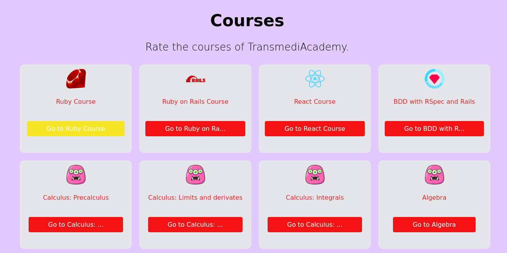

# README

Click [here](https://course-ranking-demo.herokuapp.com) for a [demo](https://course-ranking-demo.herokuapp.com).

This application is a sample for creating reviews in different courses. It works with an API built in Rails 6 and React 17 for web components. The database system is Postgres.

## Samples

